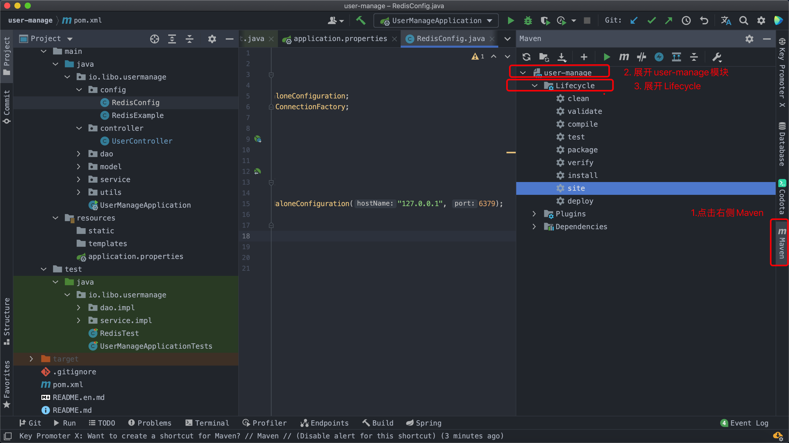

## Maven 打包SpringBoot 项目

### Maven 生命周期阶段

### package打包项目

### Maven 构建生命周期

Maven 构建生命周期定义了一个项目构建跟发布的过程。

一个典型的 Maven 构建（build）生命周期是由以下几个阶段的序列组成的

### 参考

Maven构建生命周期：https://www.runoob.com/maven/maven-build-life-cycle.html